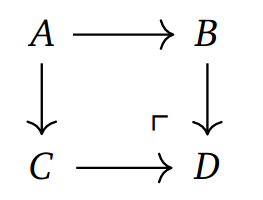

# snippets-tikzcd README

```snippets-tikzcd``` provides a variety of snippets to generate tikz-cd code for commutative diagrams of various shapes.

## Features

Currently, the extension provides snippets for generating

    - (pushout/pullback) squares
    - triangles
    - cubes
    - (short/split/long) exact sequences and the 'snake'
    - equalizers and reflexive parallel pairs
    - (augmented) (co-)simplicial objects
    - adjunctions and natural transformations

After installing the extension, just type something like ```square``` in any LaTeX document, select the desired diagram in the pop-up menu that opens and press enter.
The extension will then have generated the necessary tikz-cd code.

## Prerequisites

While it is not technically necessary, it makes a lot of sense to use a LaTeX plugin like [```LaTeX Workshop```](https://marketplace.visualstudio.com/items?itemName=James-Yu.latex-workshop) in combination with this extension.

## Showcase


The above code will generate a diagram like this:



Note: Renaming the objects ```X```, ```Y```, ```S``` and ```T``` has been done by pressing ```tab``` to cycle through those variables and replace them by ```A```, ```B```, ```C``` and ```D```
## Release Notes

### 1.0.0

Initial release of ```snippets-tikzcd```.
